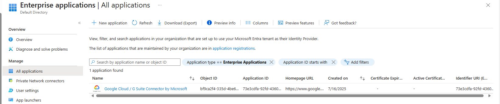
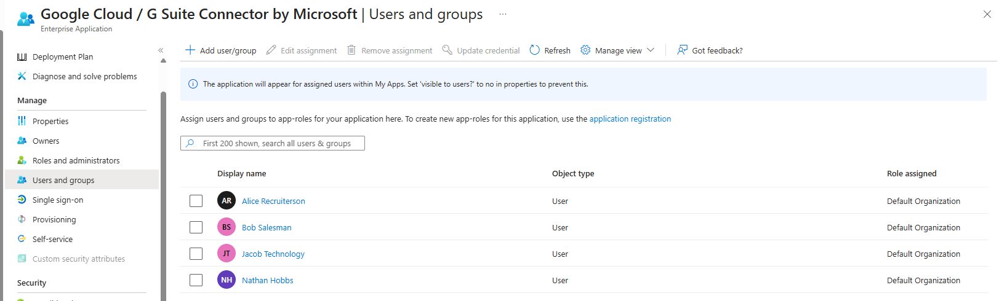

# Microsoft Entra ID Cloud IAM Lab
This project documents a personal cloud-based identity and access management (IAM) lab built using Microsoft Entra ID (formerly Azure Active Directory). The goal is to simulate real-world administrative tasks in a secure and cloud-native environment.

## Objectives

- Create and manage users and security groups
- Enforce Multi-Factor Authentication (MFA)
- Configure Self-Service Password Reset (SSPR)
- Add and configure an enterprise application (Google Cloud) using SSO
- Monitor sign-in activity via audit logs
- Set custom branding for all users

## Prerequisites

- Free Azure account
- Access to Microsoft Entra Admin Center
- Basic understanding of Identity and Access Management (IAM) concepts

## Lab Sections

### 1. User & Group Management
- Created 5 users and 3 groups using the Azure portal
- Assigned users to appropriate groups for future app access control

  

  ---
  
  

  ---

  

  ---

  

  ---

  
  
  
### 2. Multi-Factor Authentication (MFA)
- Enabled Security Defaults to enforce MFA
- Tested sign-in process with MFA challenge

### 3. Enterprise App: Google Cloud SSO
- Added Google Cloud from the Enterprise Applications gallery
- Configured Single Sign-On using default settings
- Assigned access to selected users

  
  
  ---
  
  

### 4. Activity Logs
- Viewed and interpreted sign-in logs
- Confirmed MFA challenges were successfully triggered

### 5. Set Custom Branding
- Configured a new background image for users
- Changed the visibility of items in the footer

## 🧠 Lessons Learned (Tips & Tricks)
- **Start with users and groups before configuring apps** Organizing users early makes app assignment and testing much smoother.
- **Group-based assignments are cleaner than per-user** It’s easier to manage access and test policies when apps are tied to groups instead of individual users.
- **Bulk user creation saves a lot of time** Uploading a CSV file through the Azure portal made it much faster to create multiple test users.
